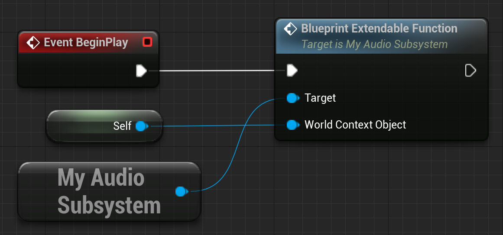

# How to Create an Audio Manager in Unreal Engine
### Game Audio Blog - Above Noise Studios
English: [https://abovenoisestudios.com/blogeng/audiosubsystemue5eng](https://abovenoisestudios.com/blogeng/audiosubsystemue5eng)\
Spanish: [https://abovenoisestudios.com/blogespanol/audiosubsystemue5esp](https://abovenoisestudios.com/blogespanol/audiosubsystemue5esp)\
\
Created By: Horacio Valdivieso\
[horacio@abovenoisestudios.com](mailto:horacio@abovenoisestudios.com)\
[LinkedIn](https://www.linkedin.com/in/horaciovaldivieso/)

---
_Unreal Engine Version: **5.2.1**_

### **English:**
This repository contains an Unreal Engine 5 project.
It uses a first-person template created with the Epic Games Launcher.
This project shows how to create an audio manager using a Game Instance Subsystem in Unreal Engine.

**How to Use?:**\
To download this project, click on the **Code** button and **Download Zip**.

To rebuild and compile the project, ensure you have [Visual Studio](https://visualstudio.microsoft.com/) for Windows or [Xcode](https://download.developer.apple.com/Developer_Tools/Xcode_13.4.1/Xcode_13.4.1.xip) for Mac.
Right-click on **MyUE5Project.uproject** and choose **"Generate Visual Studio Project Files"** on Windows or **Services > "Generate Xcode project"** on Mac.
Double-click on **MyUE5Project.uproject** to open the UE5 project.

**Rebuild the project:**

**About Compiler Versions:**

WINDOWS:

- _Visual Studio 2019 v16.11.5 to 2022 are currently compatible with UE5_.
- _Its essential to install these Workloads: **".NET Desktop Development"**, **"Desktop Development With C++"**, and **"Game Development With C++"**._\
  **Here is a useful video on how to set up VS for UE5 Development:** [LINK](https://youtu.be/8xJRr6Yr_LU?t=105)

MAC:
- _Xcode v12.4 to 15.0.1 are currently compatible with UE5_.

Enjoy!

### **Spanish:**
Este repositorio contiene un proyecto en Unreal Engine 5.
Usa una maqueta en primera persona creada con el Epic Games Launcher.
Este proyecto muestra cómo crear un audio manager usando un Game Instance Subsystem en Unreal Engine.

**Cómo Usar?:**\
Para descargar este proyecto, da click en el botón **Code** y luego en **Download Zip**.

Para construir y compilar el proyecto, asegúrate de tener [Visual Studio](https://visualstudio.microsoft.com/) para Windows o [Xcode](https://download.developer.apple.com/Developer_Tools/Xcode_13.4.1/Xcode_13.4.1.xip).
Haz click derecho en **MyUE5Project.uproject** y selecciona **"Generate Visual Studio Project Files"** en Windows o **Services > "Generate Xcode project"** en Mac.
Haz doble click en **MyUE5Project.uproject** para abrir el proyecto UE5.

**Reconstruye el proyecto:**

**Sobre las versiones del compilador:**

WINDOWS:

- _Visual Studio 2019 v16.11.5 a la 2022 son actualmente compatibles con UE5_.
- _Es esencial instalar estas cargas de trabajo: **".NET Para El Escritorio"**, **"Desarrollo Para El Escritorio Con C++"**, y **"Desarrolo De Juegos Con C++"**._\
  **Aquí hay un vídeo muy útil sobre cómo configurar VS para desarrollo en UE5:** [LINK](https://youtu.be/8xJRr6Yr_LU?t=105)

MAC:

- _Xcode v12.4 a la 15.0.1 son actualmente compatibles con UE5_.

Disfruta!

## C++ Implementation

## Blueprint Implementation

